# Blog Happened!
### Overview
'Blog Happened!' is only the beginning! This is a journey where that began with a simple idea, to create a space where people could come together and exchange ideas, share experiences, and learn from one another.
For sure, this blog would keep evolving in future, by providing features that will evolve into a dynamic platform that will serve as a hub for innovation and community engagement.   
At 'Blog Happened', we believe that words to inform, inspire, and transform lives plays a very crucial role. Users are allowed to discuss the latest trends in technology, explore the nuances of art and culture, or just offer some tips for personal development.

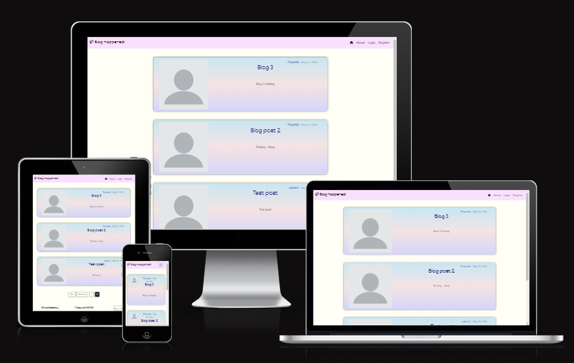

### - By Priyanka Dhanabal
The live version of the project can be viewed [here](https://pp4-blog-happened-b5fc9506d1fa.herokuapp.com/)
You can check out my Repository [here](https://github.com/Priyanka-Dhanabal/pp4)

## Table of contents
 1. [ UX ](#ux)
	- [Site Goal](#site-goal)
	- [User Stories](#user-stories)
	- [Design](#design)
	- [Wireframe](#wireframe)
 2. [Database Diagram](#database-diagram)
 2. [ Features ](#features)
 3. [ Future Feature ](#future-features)
 4. [ Technology used ](#technologies-used)
 5. [ Testing ](#testing)
	 - [Manual Testing](#manual-testing)
	 - [Validations](#validations)
 6. [ Bugs ](#bugs)
 7. [ Deployment](#deployment)
 8. [ Citation of Sources](#credits)

### User Stories
#### Site Goal
This is a project designed and developed to create a friendly atmosphere for those who are looking for a hub for innovation and community engagement. A space to inspire visitors to discuss the latest trends in technology, explore the nuances of art and culture, or just offer some tips for personal development
#### User Goals

##### Delivered goals
- As a site user I can log in to my registered account to access functionality like bookmark
- As a site user I can log out of my registered account
- As a site user I can view the list of posts, posted by many authors
- As a site user I can view posts in detail when I click on the post's title
- As a site user I can view a list of posts that a specific author has posted
- As a site user I can view and update my profile - requires login
- As a site user I can update or delete posts, if the author and the logged users are the same - requires login
- As a site user I can bookmark or remove a bookmark from a post - requires login
- As a site user I can view the list of posts that has been bookmarked - requires login
- As an admin, I can create, read, update, and delete posts so that I can manage my blog content

##### undelivered goals
- As a site user I can comment and like a post
- As a site/admin I can view the comments and number of likes on a post
- As a site user I can request for password reset
- As a Admin I have to set up google app password reset

### Design
Color Palette: 
-   The color scheme is kept simple by opting mainly for a combination of white text set against the dark backgrounds and black text against the white backgrounds. For the navbar, I selected a light color to highlight the site name as well as encourage the surrounding colors. The social links and nav bar selections change color when hovered over to highlight selection. The colors for buttons were taken from Bootstrap.  Throughout the site, the user will see light and calming, welcoming colors like this when hovering over certain sections as well as colorful buttons on each page.

Color Scheme:
- Text: #000
- Text (hyperlinks): hsl(240, 100%, 18%), hover: hsl(240, 100%, 50%);
- Body Background: #fffff6
- 
- Container Background: linear-gradient(#c7e7f3,  #f5e3e3,  #d5d5fa);
- Nav bar: #fae0ff

Typography:
- Imported Happy Monkey from Google fonts user as the primary font, and Sans-Serif used as the secondary font.
 
### Wireframes
At the start, I could not decided on the theme and color palette for the website. but later on everything came together.

- Website view

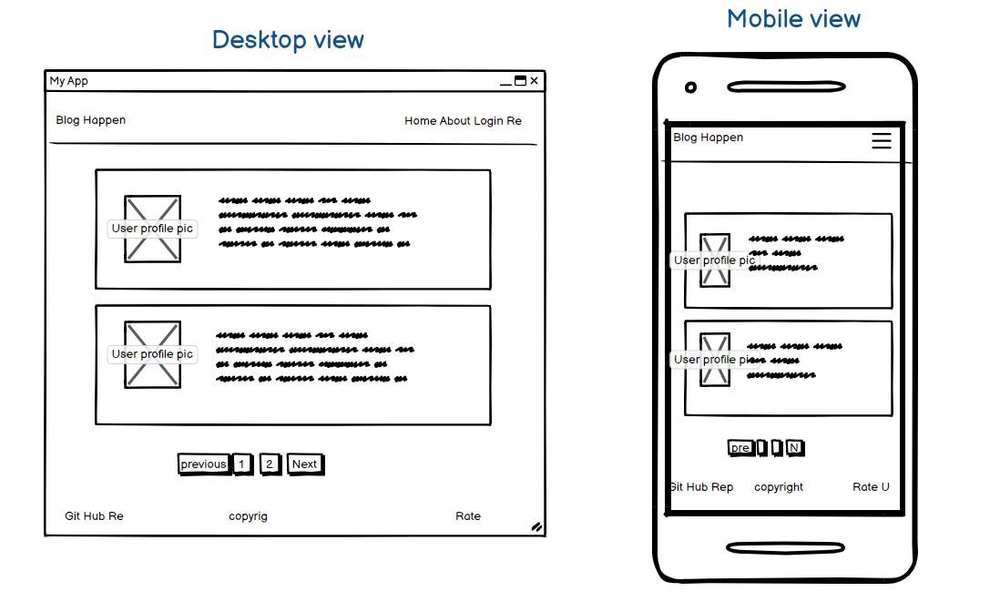

- Website view when the User is logged in

.png)

- Profile

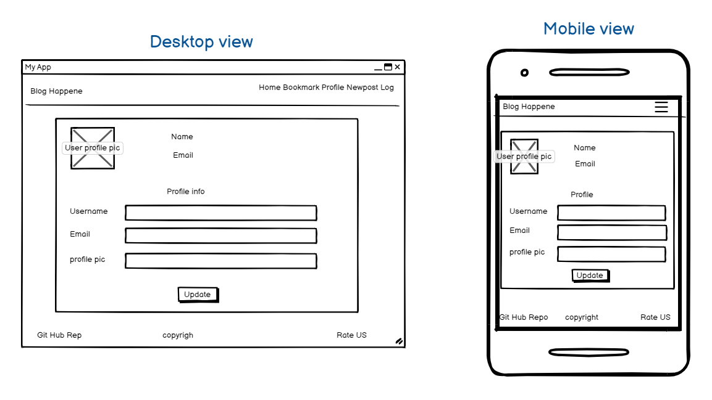

- Post detail

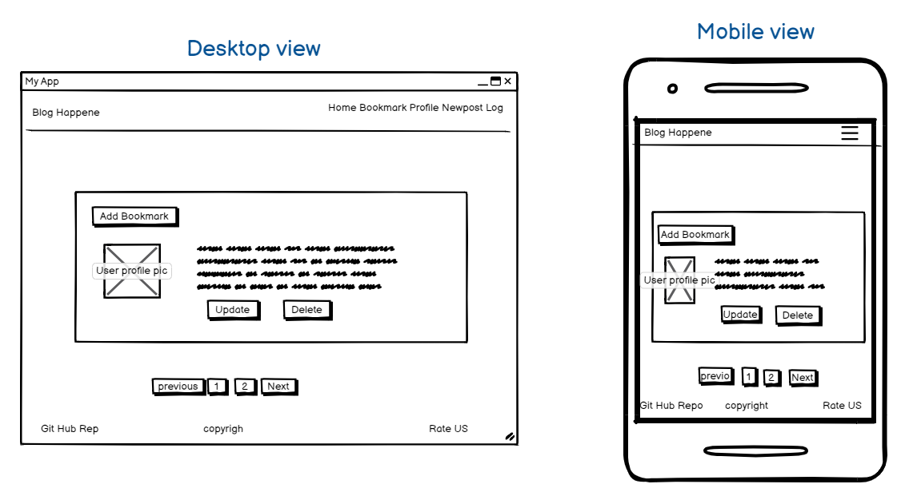

- List of posts

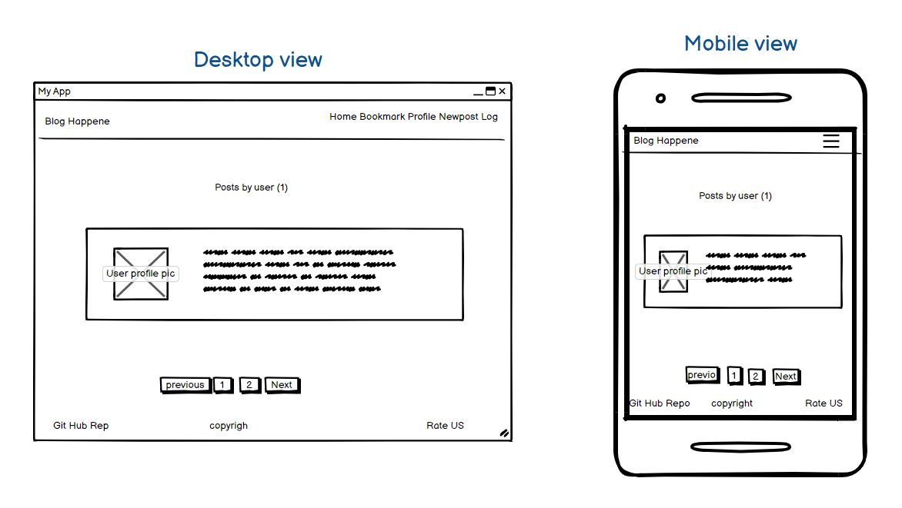

- Bookmarked posts

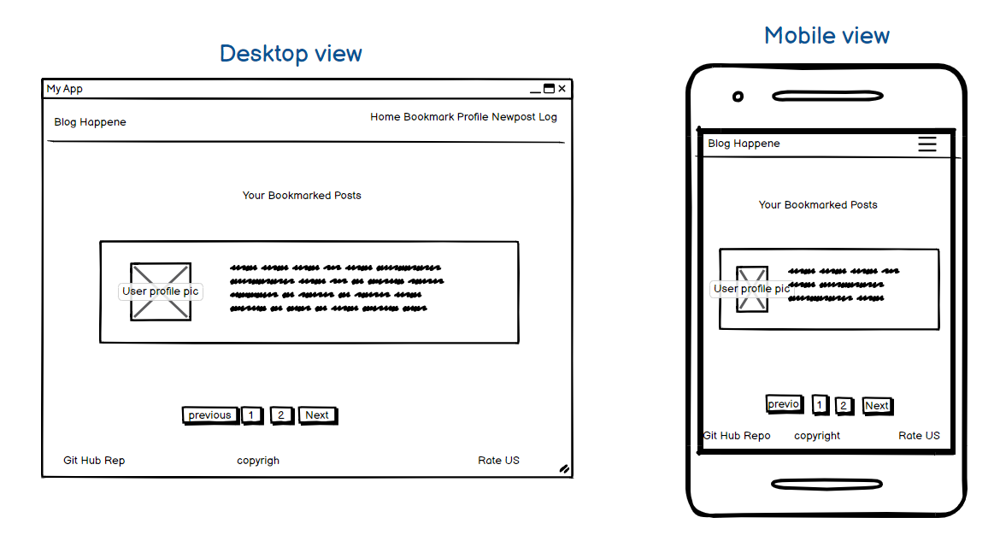

[Back to top](#table-of-contents)

## Database Structure
The entity relationship diagram for this project can be seen below.

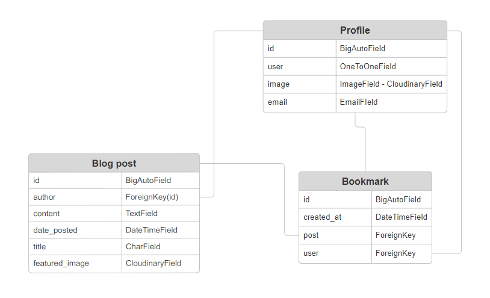

[Back to top](#table-of-contents)

## Features
**Header**	
-  The header contains the name of the website along with the logo.
- On the left side of the page, a link for home, About, Login and Register for users who has not logged in.
- For users who have logged in, they will see Home, Bookmark, Profile, New-Post, Logout.

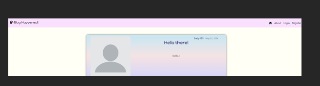

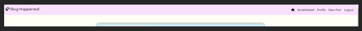

**Footer**
- Consists of copyright, navigate to GitHub repo and rate us.
- Rate us button: Users can provide a star rating for the website.

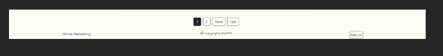

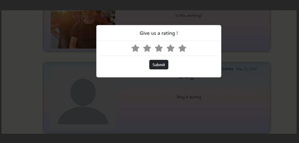

 **Main content**
- Users can log in

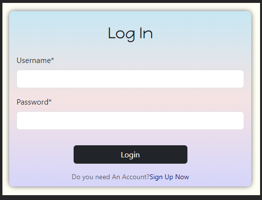

- New users can register to access the features.

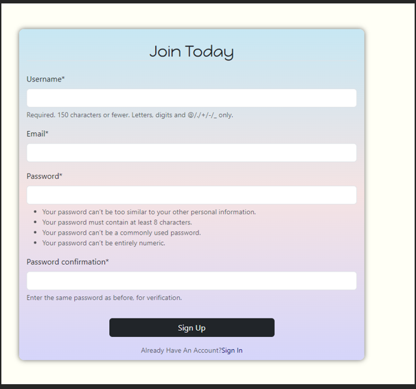

- Users who are new or those who have to yet registered will be able to view the list of posts. 
- The posts will be displayed such that the latest post is on top.

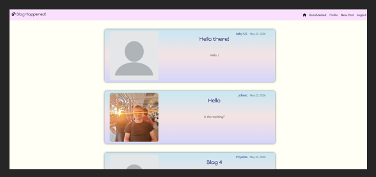

- When clicking on the Author's name, they can view a list of posts posted by an Author.

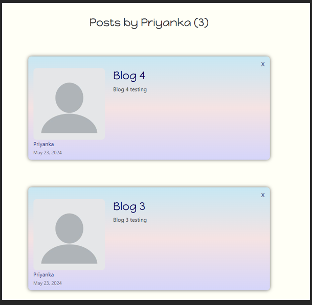

- When clicked on a post title, users can view the detailed version of the post.

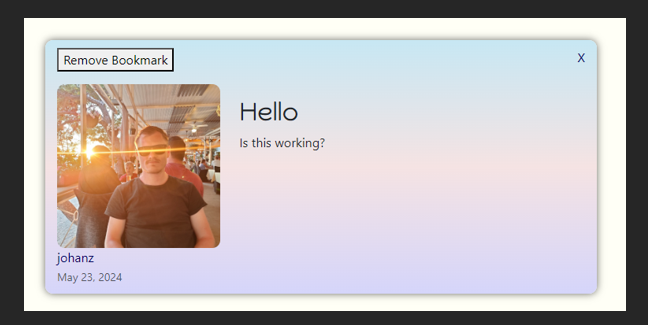
	
- Users who are logged in, they will be able to bookmark or remove the bookmark from a post.
- Users can update or delete the post if the author of the post and current user are the same.

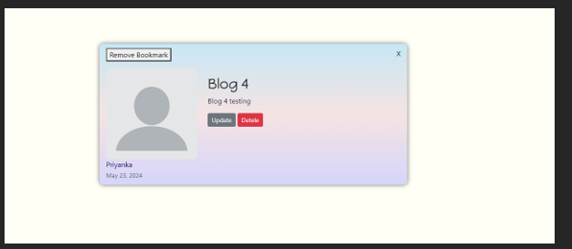

- If the user wants to delete a post, they can confirm to avoid post deletion by mistake.

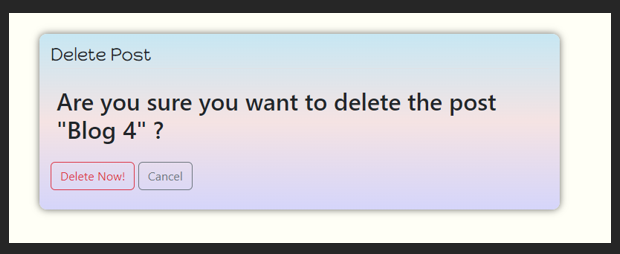

- Pagination, 3 blogs will be displayed per page.

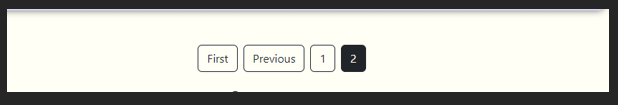

- Bookmarked- Users who are logged in, can view the list of posts that have been bookmarked.

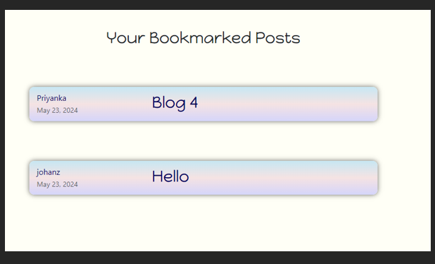

- Profile - Users can view or update their profile, username, email, and profile photo.

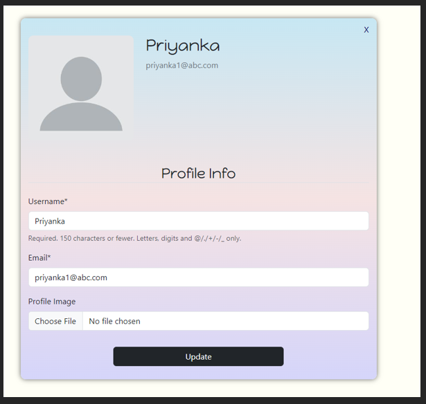

- New post - Users who are logged in can update or post a new post.

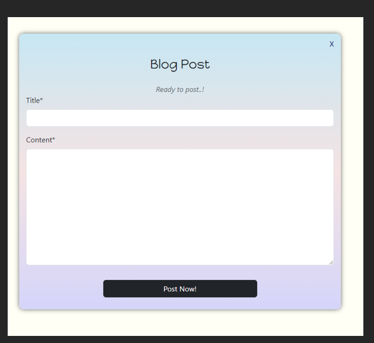

- The user can logout, and will be prompted to log back in.

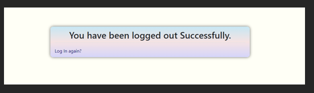

## Future Features
Due to high time constraints, I wasn't able to add these features, but I would love to in the future.

 - Google app password reset
 - Login using the Social media accounts
 - Adding comments and likes or a post
 - Make the website more user-friendly
 - Search field, Site users can easily find a post they are interested in.

[Back to top](#table-of-contents)

## Technologies Used

#### Frontend
-   **HTML**: Standard markup language for creating web pages.
-   **CSS**: Styles the appearance of web pages, including layout and design.
-   **JavaScript**: Programming language for creating interactive web elements.
-   **Bootstrap**: A front-end framework for responsive, mobile-first web development. 
-   **Font Awesome**: A toolkit for icons and fonts based on CSS.
-   **Google Fonts**: A library of web fonts.
#### Backend
- **Python**: The main programming language for backend development.
- **Django**: A high-level Python web framework for fast development and clean design. 
- **Django Allauth**: Handles authentication, registration, and account management.
#### Database
- **PostgreSQL**: An open-source relational database system. 
#### Storage
-  **Cloudinary**: Manages images and videos in the cloud.
#### Other Technologies
- **Git** Used to version control throughout my project and to ensure that a clean record is maintained.
- **GitHub**  Used to store the project's code after being pushed from Git
- **Heroku** Used to deploy the live project
- **GitPod** Used as an Integrated Development Environment for building this website.

**Packages/ Libraries Used**
The packages installed for this file can be found in requirements.txt, and can be seen below.
- asgiref==3.8.1
- cloudinary==1.36.0
- crispy-bootstrap5==2024.2
- dj-database-url==2.1.0
- dj3-cloudinary-storage==0.0.6
- Django==4.2.13
- django-crispy-forms==2.1
- gunicorn==20.1.0
- pillow==10.3.0
- psycopg==3.1.19
- sqlparse==0.5.0
- urllib3==1.26.18
- whitenoise==5.3.0

[Back to top](#table-of-contents)

## Testing
### Manual testing
The following tests were carried out manually.

| Tests | Results |
| -- | -- |
| Users can view the List of posts | Pass |
| Users can navigate to GitHub rep, opened on a new page | Pass |
| Users can provide Star ratings to the website  | Pass |
| New Users can Register for the website | Pass |
| Users receive an error while providing invalid form fields | Pass |
| Users can log in to the website | Pass |
| Users can view their profile | Pass	|
| Users can update their information on their profile page |Pass|
| Users can view a detailed version of a post by clicking the post title | Pass |
| Users can view lists of posts, posted by a specific author | Pass |
| Users can Bookmark a post when they are logged in | Pass |
| Users can update their post | Pass |
| Users can not Update other authors' post | Pass |
| Users can Delete their post | Pass |
| Users can not delete other author posts | Pass |
| Users receive a warning message, when they want to delete a post | Pass |
| Users Can view a list of posts that have been bookmarked | Pass |
| Users can remove a bookmark from a post | Pass |
| Users can logout successfully | Pass |
| Site Admin can view/update/delete a post |Pass|
| Users can create a new post | Pass |
| Users Can update an existing post | Pass |

### Validations
- Used [CI Python Linter](https://pep8ci.herokuapp.com/) to validate if all the Python files follow the PEP8 style guide.
**No errors were found.**

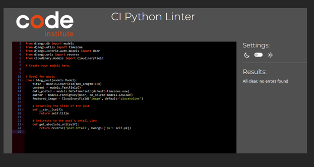

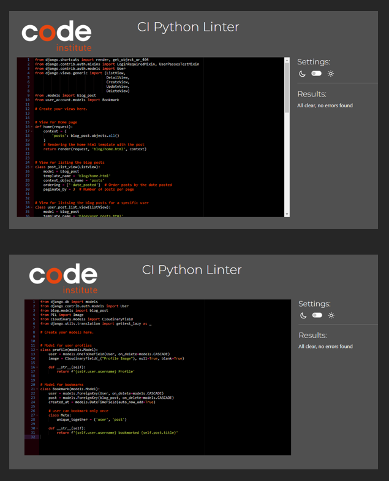

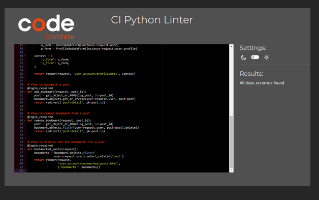

- Lighthouse

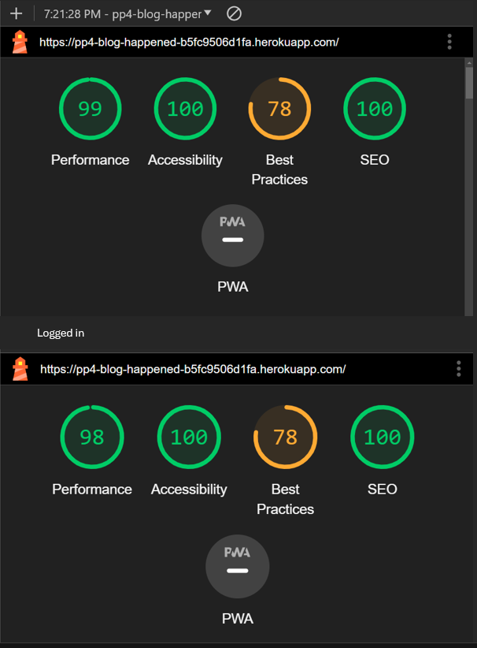

- W3C HTML

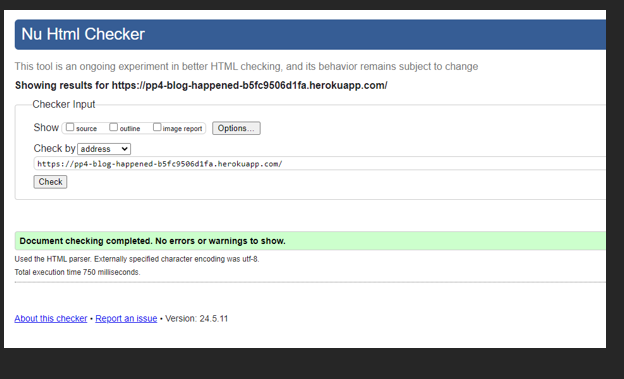

- Responsiveness

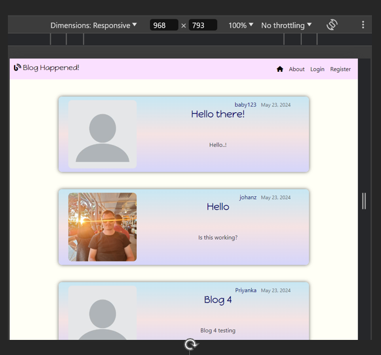

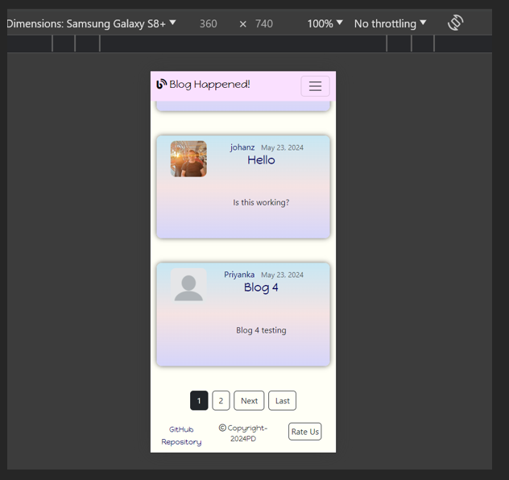

[Back to top](#table-of-contents)

## Bugs
### Solved bugs:
1. I developed the project using the local database SQlite, and I thought I will use Postgress CI database later, but this decision caused a lot of problems as I encountered so many Bugs.
2. I did not create a Cloudinary at the start but this caused issue with the profile pic as when a user upload a photo, it was not displaying nor the default image was displaying.
3. On my profile, the image was not displaying as I created a condition where the profile pic to be taken from the post-author-profile pic, I had a call with tutor support and they explained to me that it is easier when you try to access the profile pic of the current user who is logged in.
4. Since I got a new job, and new role, I had to skip most of the Django project from LMS. I realized that I made a huge mistake because I kept encountering bugs which caused so much delay and I was not able to fulfill the features I initially thought. When I finish the course, I will definitely will take my time and build a solid project that has all the features the blog should have.

### Unfixed Bugs:

1. When a user tries to close the post container, the user is taken back to the home page instead of the previous page.

[Back to top](#table-of-contents)

## Deployment

This project is deployed on Heroku.

1. Login to [Heroku](https://id.heroku.com/login) or create a account.
2. On the main page, click the button labeled as New and from the drop-down menu select create New App.
3. Please enter a unique app name.
4. Select your region and click on Create App button
5. Within your page, navigate to settings tab
6. Scroll down to view the Config Vars section and click Reveal Config Vars.
	- Add a value for 'SECRET_KEY' connecting to your django environment.
	- Add a value for 'DATABASE_URL' connecting to your postgreSQL database.
	-  Add a value for 'ClOUDINARY_URL' connecting to cloudinary's cloud hosting service for media.
9. Scroll up and navigate to Deploy tab.
10. Select Github as the deployment method
11. Search for the repository name and click the connect button
12. Scroll to the bottom of the deploy page and select the preferred deployment type
13. Click either Enable Automatic Deploys for automatic deployment when you push updates to Github or Manual deploy to deploy the current state of the branch. - I used Manual deploy for this project.

[Back to top](#table-of-contents)

## Credits
### Content and resources
1. Code Institute
	- Course content for the portfolio project 4 helped greatly in understanding the need to complete the project.
2. W3 School - Used to reference python related methods.
3. Lucidchart - used to create a flow chart to illustrate my project idea.
5. StackEdit - To edit my readMe file content.
6. geeks for geeks - To understand few challenges that i faced during the development of this project.
6. smartdraw - used to draw the ERD diagram

### Acknowledgements

Since I got a new job as soon as I finished my 3rd portfolio project, I have been working and doing this course full time, it was greatly difficult to manage my new role and spend time studying and building my current website. There are a lot of features I could not implement because of the time crunch. However, I am very happy how my website turned out after encountering so many bugs and issues. 
I greatly appreciate the help I received from my Mentor and one of my friends from the course () 

Mentor - Akshat_Garg
- My Mentor provided feedback and guidance throughout. I appreciate his help in overcoming a lot of bugs and issues.

Kristyna - Cohort facilitator
- She was very helpful in making me understand the various requirements to achieve a good project.

Linus J_5P

- Very helpful and motivating during the phase when I was about to give up on this project, helped me to look through the code, and helped me figure out the issues.

*****************
[Back to top](#table-of-contents)
